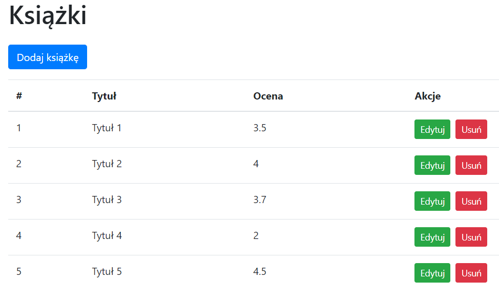
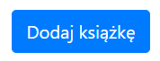
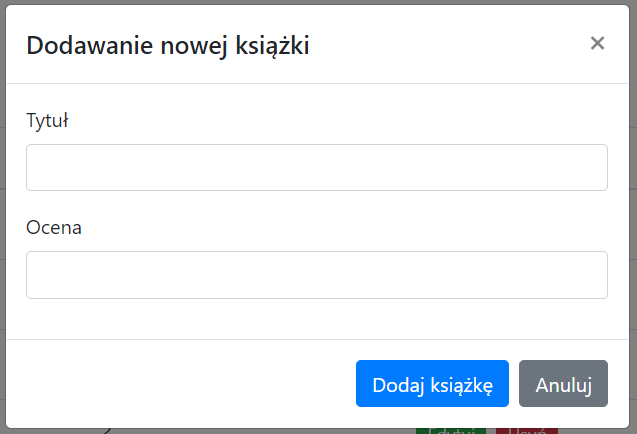
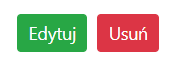
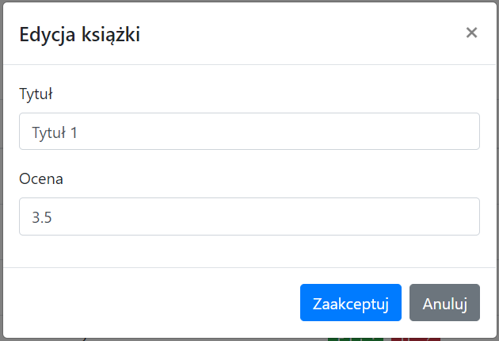

# Książki
Jest to prosta aplikacja napisana przy użyciu React, Boostrap oraz Axios. Pozwala ona na dodawanie, edytowanie oraz usuwanie książek z bazy danych.

## Instalacja
Przed instalacją tego projektu należy zainstalować serwer JSON aby API działało poprawnie: https://github.com/Dziadejro/JSON-Serv

*Instrukcja instalacji również znajduje się na tej stronie.*

Po udanej instalacji należy **koniecznie** uruchomić serwer na porcie 3000!

Gdy serwer został poprawnie uruchomiony, należy pobrać ten projekt i uruchomić go przy pomocy komendy: `npm start`. Jeżeli poprawnie uruchomiliśmy serwer JSON, projekt powinien domyślnie otworzyć się na porcie 3001.

## Użytkowanie
Korzystanie z aplikacje jest balanie proste. Do jego podstawowych funkcji należy dodawanie nowych książek:

Jak i też edycja lub usunięcie już istniejących książek:

Do API możemy również dostać się z poziomu aplikacji takich jak Postman, które pozwalają nam na bezpośrednie wydawanie zapytań.

Aby odwołać się do naszego API, należy użyć linku: `localhost:3000/books`.

Kluczowe parametry api:

`"id"` - ID książki

`"title"` - Tytuł książki

`"rating"` - Ocena książki

## Technologie

Do napisania tej aplikacji zostały użyte podane technologie:
- Axios
- React
- Bootstrap 4 (Reactstrap)
- JSON
- REST API
